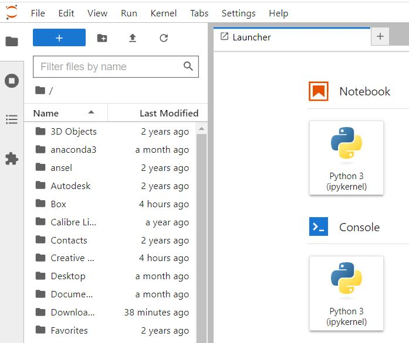
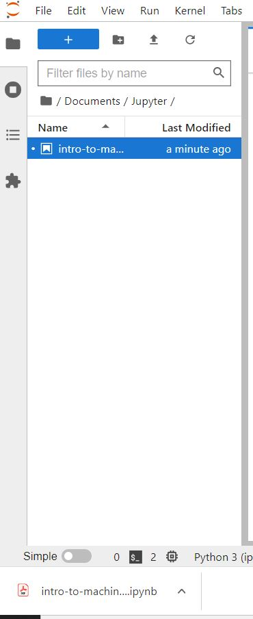
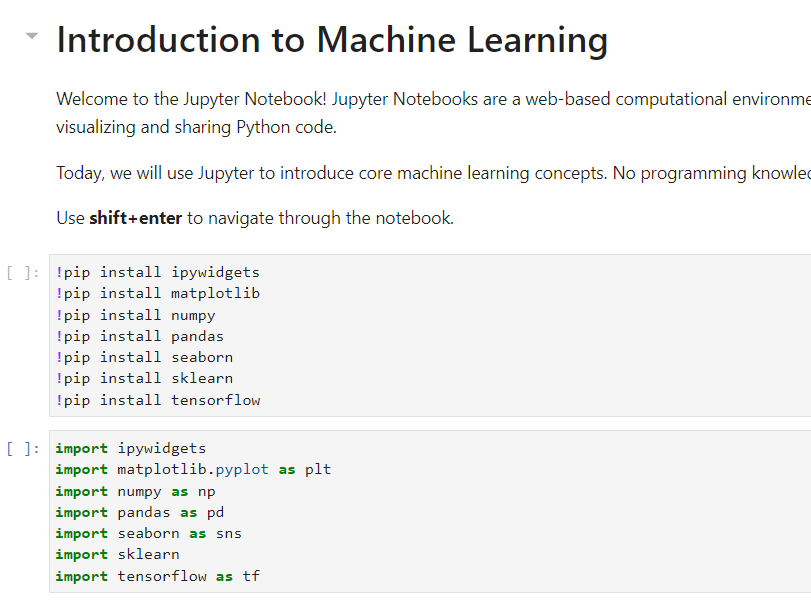

# Intro to Machine Learning Workshop
This repository contains the Jupyter Notebook and setup/installations instructions to run the workshop locally on Windows.

## Setup Instructions for Windows
### Installing Python
1. Navigate to the [Python download page](https://www.python.org/downloads/windows/)
1. Scroll down until you see ```Python 3.9.10 - Jan.14, 2022```


3. Select the ```Download Windows installer (64-bit)```
    - Really any Python version should work
3. Launch the installation executable in the bottom left of your screen (if you're using Google Chrome) when it is ready


4. In the setup screen check ```Add Python 3.9 to PATH``` checkbox and then click ```Install Now```
    - It's very important to check this box or else you will have to add the Python to your PATH manually and that's not fun


5. When it finishes installing, verify the Python installation by first opening a command prompt. To do this type ```cmd``` in the bottom left search bar and press enter


6. Type ```python``` into the command prompt and you should see the python version and 3 symbols ```>>>``` show up
6. If your command prompt similar to this then Python should have installed properly


7. Type ```exit()``` to close the Python interpreter

### Installing JupyterLab
JupyterLab is the development environment we will be using for this workshop. The official JupyterLab documentation is found [here](https://jupyterlab.readthedocs.io/en/stable/).
Inside your command prompt install Jupyter with 
```bash
pip install jupyterlab
```
Now you can launch Jupyter with
```bash
jupyter-lab
```
or
```bash
python -m jupyter lab
```
A browser should open with your Jupyter environment. In the left side pane, navigate to the ```Documents``` folder or whichever folder you would like to save the Jupyter Notebook in



Click the ```New Folder``` button in the top left (right of the blue +) and name it ```Jupyter```, then navigate inside the ```Jupyter``` folder.
Download the [Jupyter Notebook Here](https://drive.google.com/uc?export=download&id=1oofAdu5_vtJOdWCGINXhS3Wd4OxOXsVj) and drag and drop it anywhere inside the white space of the left side pane to import the notebook



Once the notebook is imported double click the ```intro-to-machine-learning.ipynb``` file to open the notebook
Run the first two cells using the ```shift+enter``` keys (the second cell has all the ```import``` statements). 
    - The first cell downloads the libraries used in the notebook __This cell will take around 10 minutes to install everything__
    - The second cell imports the libraries which will ensure they installed correctly
   


If the first two cells run fine and do not produce any red output, everything is set up properly  
