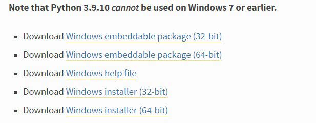
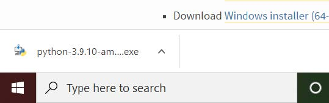
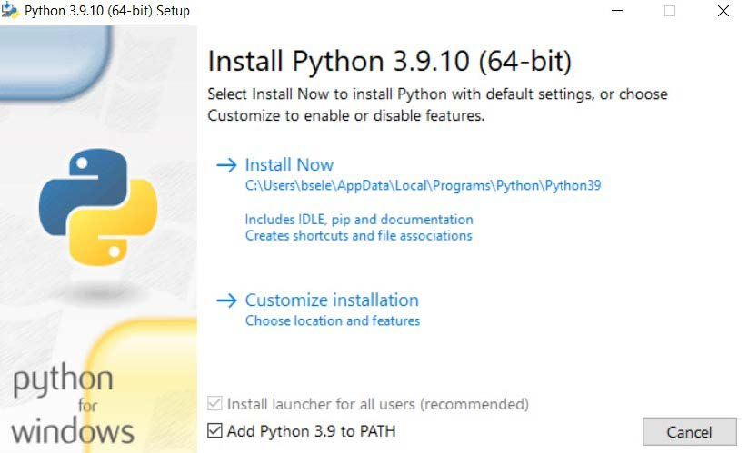
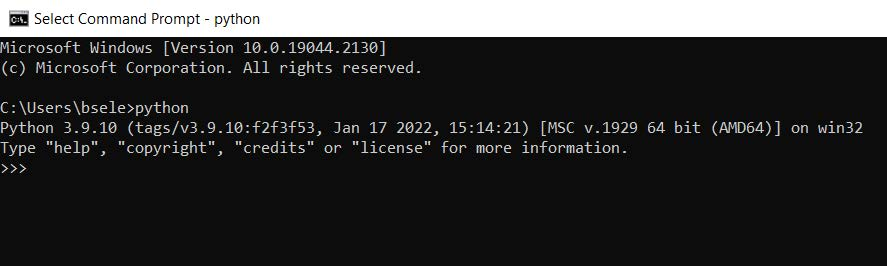

# Intro to Machine Learning Workshop
Contains the Jupyter Notebook and setup/installations instructions to run the notebook locally.
## Setup Instructions for Windows
### Installing Python
1. Navigate to the [Python download page](https://www.python.org/downloads/windows/)
1. Scroll down until you see ```Python 3.9.10 - Jan.14, 2022```


3. Select the ```Download Windows installer (64-bit)```
    - Really any Python version should work
3. Launch the installation executable in the bottom left of your when it is ready


4. In the setup screen check ```Add Python 3.9 to PATH``` chekcbox and then blick ```Install Now```
    - It's very important to check this box or else you will have to add the Python to your PATH manually and that's not fun


5. When it finishes installing, verify the Python installation by first opening a command prompt. To do this type ```cmd``` in the bottom left search bar and press enter


6. Type ```python``` into the command prompt and you should see the python version and 3 symbols ```>>>``` show up
6. If your command prompt similar to this then Python should have installed properly


7. Type ```exit()``` to close the Python interpreter

### Installing JupyterLab
JupyterLab is the development environment we will be using for this workshop. The official JupyterLab documentation is found [here](https://jupyterlab.readthedocs.io/en/stable/).
1. Inside your command prompt install Jupyter with 
```bash
pip install jupyterlab
```
1. Now you can launch Jupyter with
```bash
jupyter-lab
```
or
```bash
python -m jupyter lab
```
1. A browser should open with your Jupyter environment. In the left side pane, navigate to the ```Documents``` folder or whichever folder you would like to save the Jupyter Notebook

