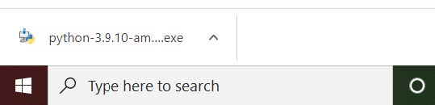

# Intro to Machine Learning Workshop
Contains the Jupyter Notebook and setup/installations instructions to run the notebook locally.
## Setup Instructions for Windows
### Installing Python
1. Navigate to [Python's webpage](https://www.python.org/downloads/windows/)
1. Scroll down until you see ```Python 3.9.10 - Jan.14, 2022```


3. Select the ```Download Windows installer (64-bit)```
    1. Really any Python version should work
4. Launch the installation executable in the bottom left of your when it is ready



